# 安装Ubuntu
### 一、配置vm
#### 1.1 进入VMware
- 双击VMware图标，看到如下界面。

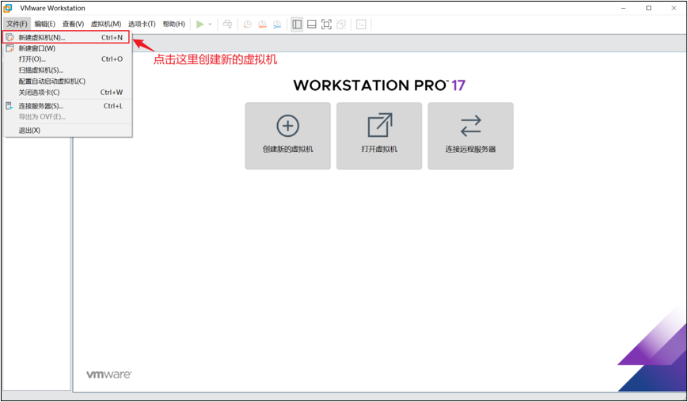

#### 1.2 选择配置类型
- 选择“自定义新的虚拟机”

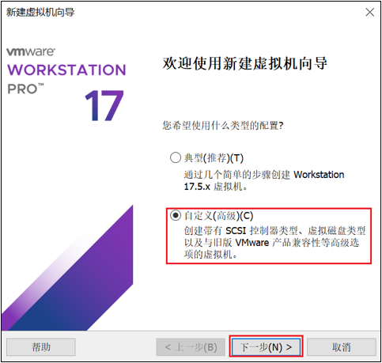

#### 1.3 选择硬件兼容性版本
- 选择“Workstation 17.x”

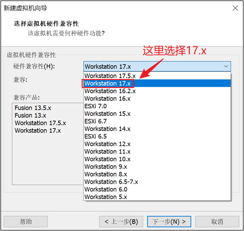

#### 1.4 选择当前虚拟机的操作系统
- 选择“稍后安装操作系统”

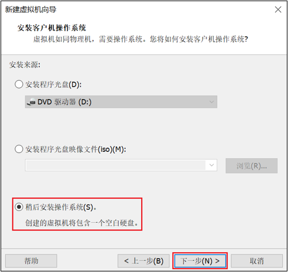

#### 1.5 选择虚拟机将来需要安装的系统
- 选中“Linux”和选择“Ubuntu64位”

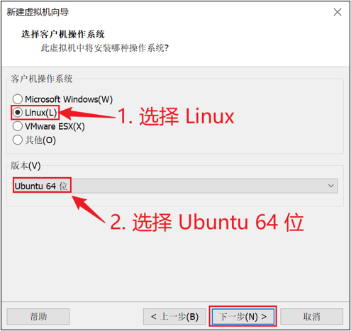

#### 1.6 配置电脑
- 给自己配置电脑取个名字，并存放在物理机的位置在哪。

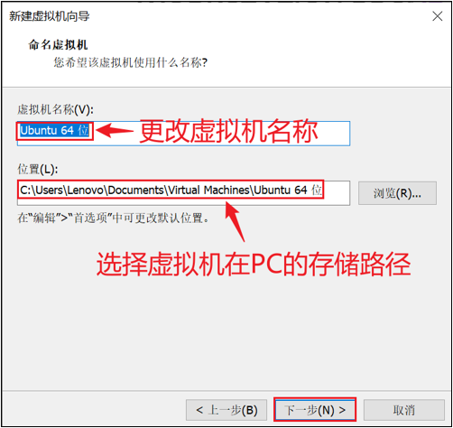

#### 1.7 选择CPU的个数
- 一般选择1个处理器和4个内核；配置高的，可以选择2个处理器和4个内核。

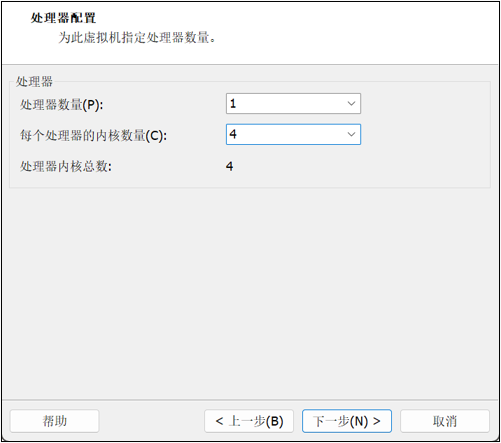

#### 1.8 设置虚拟机的内存
- 内存4-8G，如果电脑配置高可以酌情增加。

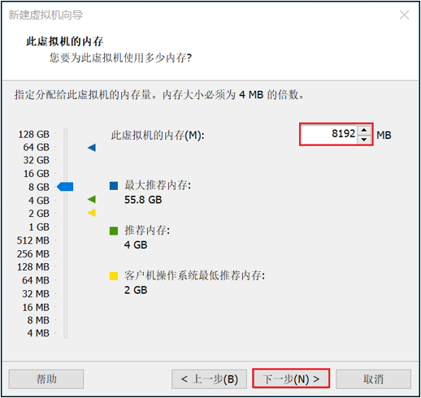

#### 1.9 选择虚拟机上网方式
- 选择NAT的方式

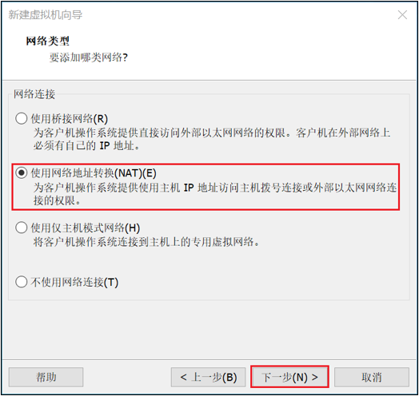

#### 1.10 选择对应的文件系统的IO方式
- 选择“LSI Logic”

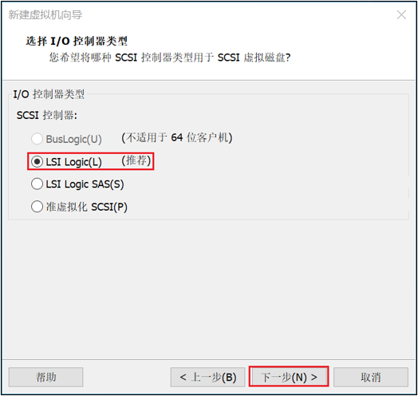

#### 1.11 选择磁盘的类型
- 选择“SCSI(S)”

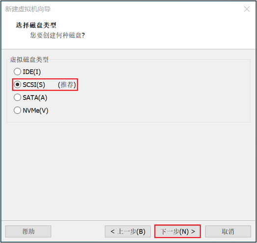

#### 1.12 选择磁盘的种类
- 选择“创建新虚拟磁盘”

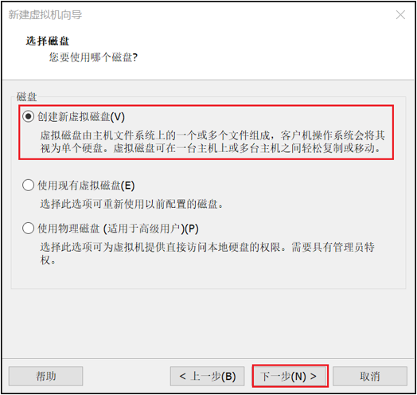

#### 1.13 选择虚拟机的磁盘大小和文件个数
- 指定最大磁盘大小为：50G
- 选择虚拟硬盘文件个数为：1

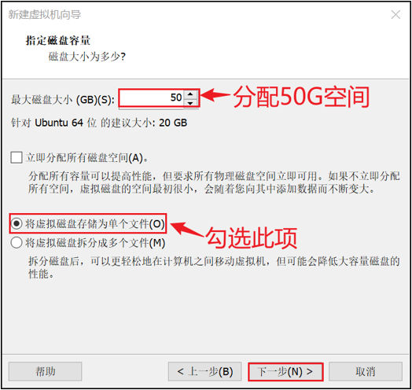

#### 1.14 选择虚拟机文件的存放位置

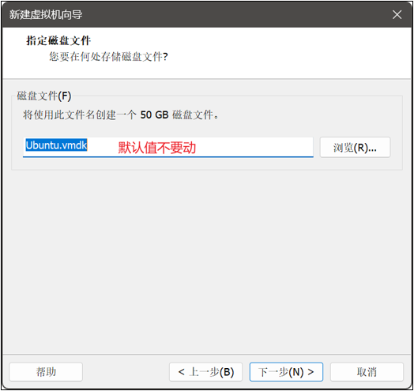

#### 1.15 配置完毕

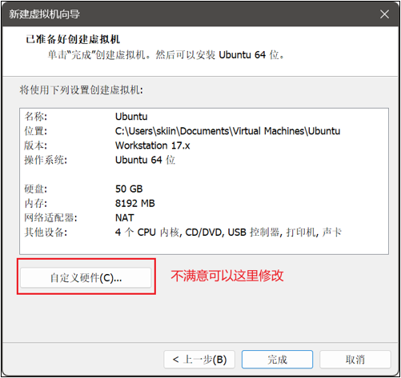
